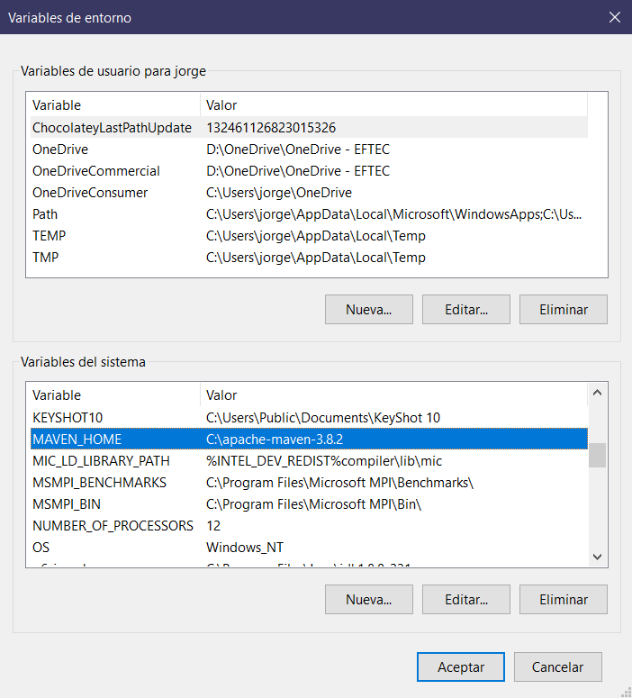

# maven

1. Descargar https://maven.apache.org/download.cgi

2. E instalar (descomprimir en el disco c:\)
3. Configurar la variable del entorno de windows como:

MAVEN_HOME e indicar la carpeta donde se descomprimio maven

PATH y agregar la carpeta binario del maven

